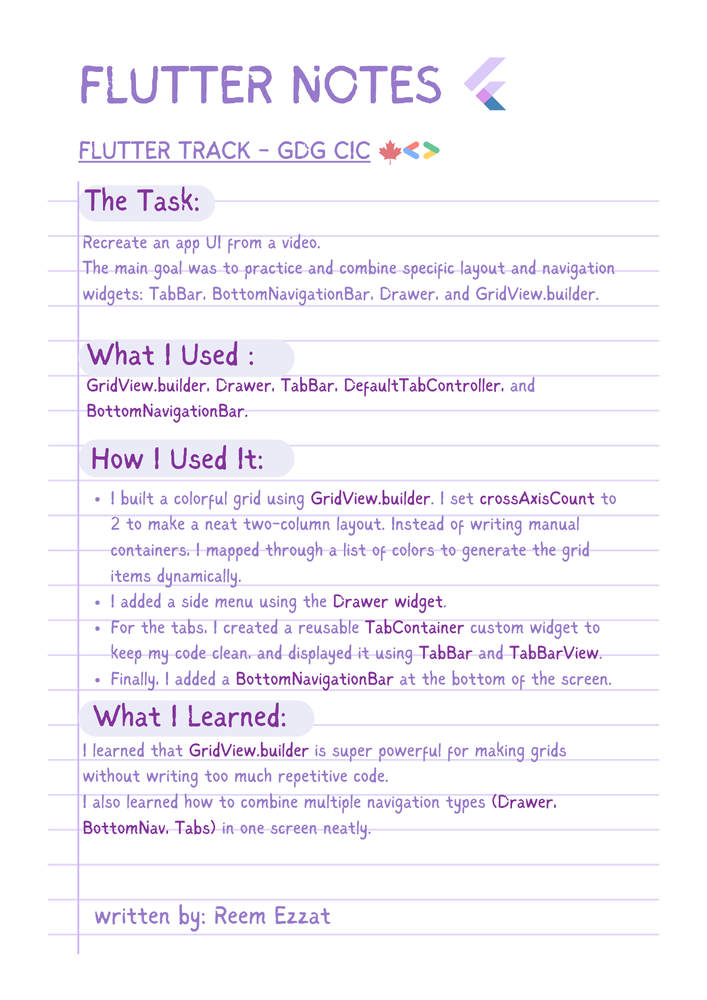
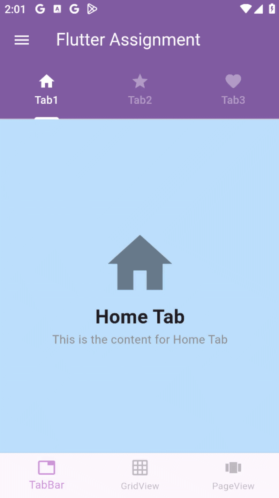

# 📱🔁 Navigation-Layout-Task 





## 💻 Example Code

```dart
GridView.builder(
  itemCount: colors.length,
  gridDelegate: const SliverGridDelegateWithFixedCrossAxisCount(
    crossAxisCount: 2, // 2 items per row
    crossAxisSpacing: 10, // Horizontal space
    mainAxisSpacing: 10, // Vertical space
  ),
  itemBuilder: (context, index) {
    return Container(
      decoration: BoxDecoration(
        color: colors[index],
        borderRadius: BorderRadius.circular(10),
      ),
      child: const Icon(Icons.grid_on, color: Colors.white),
    );
  },
)
````
💡 **Tip:** When using **GridView.builder**, always remember the difference between **crossAxisSpacing** and **mainAxisSpacing**. 

**crossAxisSpacing** is the space between columns (left/right), and **mainAxisSpacing** is the space between rows (top/bottom).

Adding just a little bit of spacing makes your grid look so much cleaner!

## 🎬 DEMO

